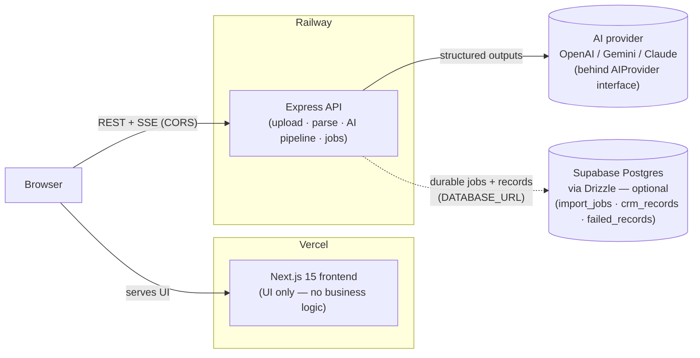
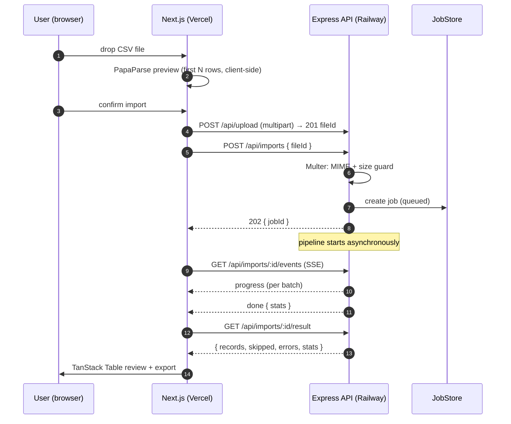
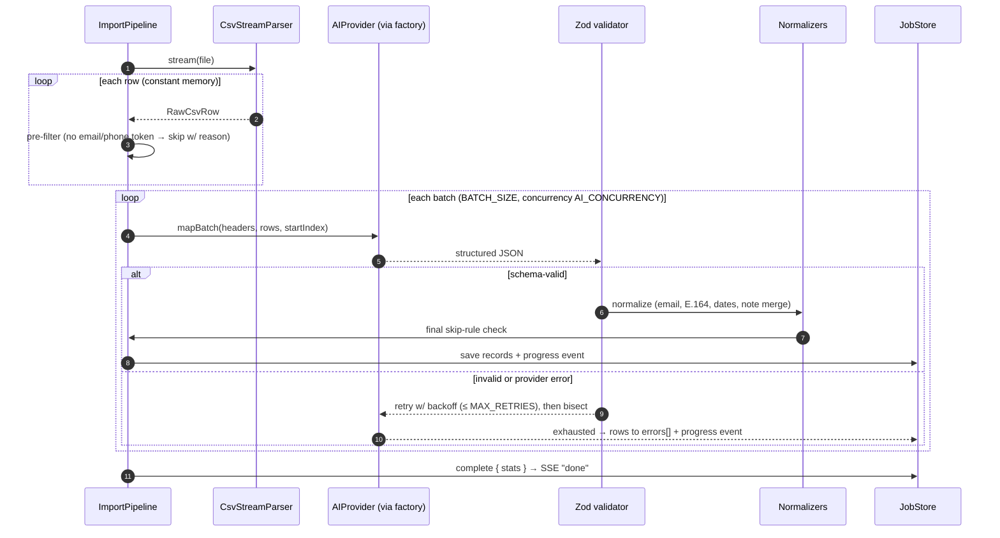
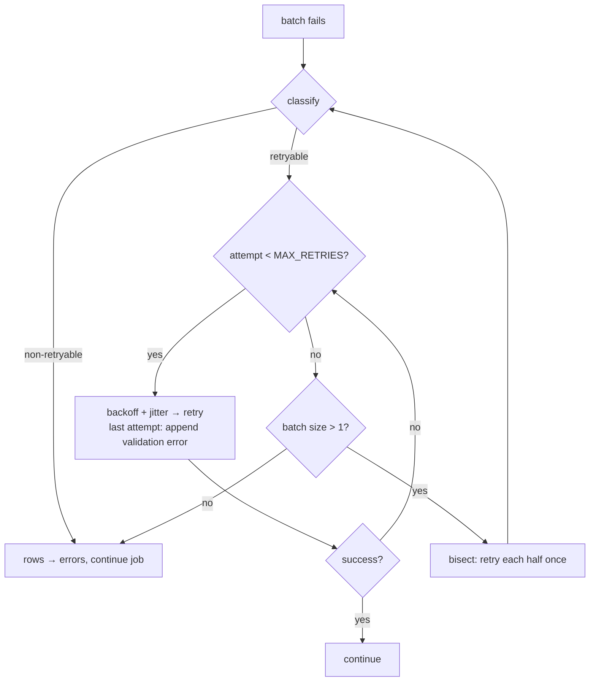
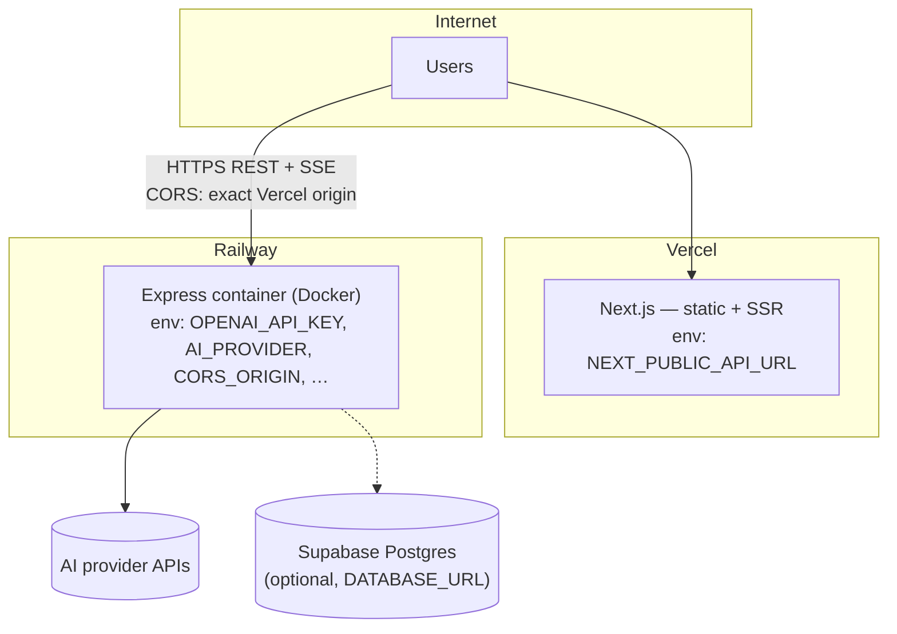

# GrowEasy Importer — Architecture

> **Status:** Final (Milestone 12) — matches the implemented system.
> This document is the single reference for system design decisions; business rules in §2 are
> frozen unless the assignment spec changes. Endpoint details live in [API.md](API.md), prompt
> design in [PROMPTS.md](PROMPTS.md), launch steps in
> [PRODUCTION-CHECKLIST.md](PRODUCTION-CHECKLIST.md).

An AI-powered CSV importer that ingests **arbitrary lead CSVs** (no fixed column names), maps
them **semantically** into the GrowEasy CRM schema via an LLM, normalizes contact data, and
returns an auditable, validated result set — at a scale of tens of thousands of rows.

---

## Table of contents

1. [System architecture](#1-system-architecture)
2. [Business rules (frozen)](#2-business-rules-frozen)
3. [Monorepo & folder structure](#3-monorepo--folder-structure)
4. [Data flow](#4-data-flow)
5. [API contracts](#5-api-contracts)
6. [AI pipeline](#6-ai-pipeline)
7. [Batch processing](#7-batch-processing)
8. [Retry strategy](#8-retry-strategy)
9. [Error handling](#9-error-handling)
10. [Sequence diagrams](#10-sequence-diagrams)
11. [Deployment architecture](#11-deployment-architecture)
12. [Testing strategy](#12-testing-strategy)
13. [Future scalability](#13-future-scalability)
14. [Decision log](#14-decision-log)
15. [Open questions](#15-open-questions)

---

## 1. System architecture

Two independently deployable applications plus a shared contracts package:



**Principles applied throughout:**

- **Separation of concerns** — the frontend renders and orchestrates UX; every business rule
  lives server-side. The API is a self-contained product usable by any client.
- **Single source of truth** — the CRM Zod schema and all API DTOs live in `@groweasy/shared`;
  frontend and backend import the *same* types, so they cannot drift.
- **Dependency inversion (SOLID)** — the import pipeline depends on the `AIProvider` and
  `JobStore` *interfaces*, never on OpenAI or the in-memory store directly. Swapping either is a
  configuration change, not a refactor.
- **Fail fast, degrade gracefully** — environment is Zod-validated at boot; at runtime a bad
  row or a failed batch degrades to a per-row error, never a crashed job.
- **Readable over clever** — code is optimized for the next reader.

### Why a separate Express API instead of Next.js route handlers?

The core workload — stream-parse a large CSV, run minutes of batched LLM calls, push live
progress — belongs on a **long-lived Node process** (Railway container). Serverless function
timeouts and per-invocation statelessness on Vercel fight all three requirements. This also
matches the required deployment split exactly.

---

## 2. Business rules (frozen)

These come from the assignment spec and are **not negotiable in code review** — they are encoded
once in `@groweasy/shared` and enforced by both the AI prompt and post-hoc Zod validation.

### 2.1 Target CRM schema

| Field | Type | Rule |
| --- | --- | --- |
| `name` | `string` | Lead's full name, whitespace-normalized. |
| `email` | `string` | Primary email, lowercased + trimmed. Additional emails → `crm_note`. |
| `mobile` | `string` | Primary mobile in E.164 (`+<country><number>`). Additional numbers → `crm_note`. |
| `status` | enum | **Only**: `GOOD_LEAD_FOLLOW_UP` · `DID_NOT_CONNECT` · `BAD_LEAD` · `SALE_DONE`. Inferred from row evidence (remarks/labels); never invented. |
| `data_source` | enum \| `""` | **Only**: `leads_on_demand` · `meridian_tower` · `eden_park` · `varah_swamy` · `sarjapur_plots`. Set **only when confident**; otherwise empty string. |
| `crm_note` | `string` | Merged context — see 2.3. |

### 2.2 Skip rule

> Skip a record **only if it contains neither an email nor a mobile number**.
> If **either** exists, process the record.

Enforced in two stages (see §6.4): a cheap deterministic pre-filter before any AI call, and an
authoritative post-AI check after normalization. Skipped rows are returned with a reason —
never silently dropped.

### 2.3 `crm_note` merge rules

The note **merges** (in stable order): remarks/notes/comments/follow-up columns → additional
email addresses → additional phone numbers → any unmapped-but-useful columns. Useful context is
preserved verbatim; the model is explicitly instructed **not to hallucinate** — every fragment
in the note must be traceable to a cell in the source row.

### 2.4 AI conduct rules

- The model must return **strict structured JSON** (provider-native structured outputs).
- Every response is **re-validated with Zod** server-side — the model is never trusted.
- Mapping is **semantic**: `"e-mail addr"`, `"contact"`, `"Correo"` and an unlabeled column of
  `x@y.com` values must all resolve to `email`. Column names are hints, not contracts.

---

## 3. Monorepo & folder structure

**Tooling: npm workspaces** (final decision — see decision log #2). The repo optimizes for
zero-friction review: `git clone && npm install && npm run dev` with no global tooling. Root
scripts run tasks in dependency order (`shared → backend/frontend`). The scale-up path is
pnpm + Turborepo (strict node_modules, task caching); the migration is mechanical
(workspace file + `turbo.json` + CI/Docker command swaps) and deliberately deferred until the
team/CI size justifies the extra toolchain.

```
groweasy-importer/
├─ frontend/                        # Next.js 15 (App Router) — UI only
│  └─ src/
│     ├─ app/                       # layout, page, providers (React Query)
│     ├─ components/ui/             # shadcn/ui primitives
│     ├─ features/import/           # dropzone, preview, progress, results table
│     ├─ lib/                       # api client, utils
│     └─ hooks/                     # useImportJob, useSseProgress, …
│
├─ backend/                         # Express + TypeScript — all business logic
│  └─ src/
│     ├─ index.ts                   # bootstrap + graceful shutdown
│     ├─ app.ts                     # middleware wiring (testable factory)
│     ├─ config/env.ts              # Zod-validated environment (fail fast)
│     ├─ routes/                    # HTTP surface: /api/health, /api/imports
│     ├─ controllers/               # thin — parse request, call service, shape response
│     ├─ middleware/                # error handler, 404, multer upload, rate limit
│     ├─ lib/                       # pino logger, typed error classes
│     └─ services/                  # ← the core; each independently testable
│        ├─ csv/                    # streaming parser + row heuristics (pre-filter)
│        ├─ ai/
│        │  ├─ provider/            # AIProvider interface, OpenAIProvider,
│        │  │                       #   (GeminiProvider, ClaudeProvider), factory
│        │  ├─ prompts/             # versioned prompt modules: v1/{system,developer,user}
│        │  └─ pipeline/            # batcher, retry policy, mapping orchestrator
│        ├─ normalize/              # email, phone (E.164), date, whitespace, note-merge
│        └─ jobs/                   # JobStore interface, InMemoryJobStore, SSE hub
│
├─ shared/                          # @groweasy/shared — single source of truth
│  └─ src/
│     ├─ crm.ts                     # CrmLeadSchema, CrmStatus, DataSource (Zod + types)
│     ├─ api-contracts.ts           # request/response DTOs, SSE event types
│     └─ index.ts
│
├─ docs/ARCHITECTURE.md             # this document
├─ docker-compose.yml               # full-stack local run
├─ turbo.json  ·  pnpm-workspace.yaml
├─ tsconfig.base.json  ·  eslint config  ·  prettier config
└─ README.md
```

**Layering rule (enforced by review):** `routes → controllers → services → lib/shared`.
Services never import Express types; controllers never contain business logic. This is what
makes every service unit-testable without HTTP.

---

## 4. Data flow

```
① SELECT      Browser: drop CSV (React Dropzone)
② PREVIEW     Browser: PapaParse parses first 100 rows locally → instant table, zero upload
③ UPLOAD      POST /api/upload (multipart) → Multer guards size/MIME → 201 { fileId }
④ CONFIRM     User reviews the preview → confirmation dialog → POST /api/imports { fileId }
                → 202 { jobId } returned immediately (job runs in the background)
⑤ PARSE       Backend: csv-parser streams rows (constant memory, any file size)
⑥ PRE-FILTER  Heuristic scan: rows with no email-like AND no phone-like token anywhere
                → skipped(reason) without spending AI tokens
⑦ BATCH       Rows grouped into BATCH_SIZE chunks; AI_CONCURRENCY parallel workers
⑧ MAP (AI)    AIProvider.mapBatch() → provider-native structured outputs (+ repair hints on retry)
⑨ VALIDATE    Zod parse of every response + row-coverage invariant; failures → retry → bisection
⑩ NORMALIZE   email lowercase · mobile → E.164 (libphonenumber) · whitespace · note cleanup
⑪ FINAL SKIP  Authoritative rule check: neither valid email nor valid mobile → skipped
⑫ PROGRESS    Every batch completion → SSE progress event → frontend progress UI
⑬ RESULT      GET /api/imports/:id/result → { records, skipped, errors, warnings, stats }
                → TanStack Table review → CSV export
```

The client-side preview (②) is intentionally **not** the parse of record — it exists purely for
UX (instant feedback, catch the wrong file before uploading). The backend re-parses from byte 0
so results never depend on browser parsing quirks.

---

## 5. API contracts

All DTOs live in `shared/src/api-contracts.ts`. Shapes below are the contract; field-level Zod
schemas are the implementation.

Full endpoint reference with examples: **[docs/API.md](API.md)**.

| Method & path | Purpose | Success response |
| --- | --- | --- |
| `POST /api/upload` (multipart `file`) | Store a CSV temporarily | `201 { fileId, filename, sizeBytes, uploadedAt, expiresAt }` |
| `POST /api/parse` | Server-truth preview (headers, N rows, exact count) | `200 { headers, rows, totalRows }` |
| `POST /api/imports` `{ fileId }` | Start the AI import job | `202 { jobId }` |
| `GET /api/imports/:id` | Job snapshot (polling fallback) | `200 ImportJobSnapshot` |
| `GET /api/imports/:id/events` | **SSE** live progress | event stream (below) |
| `GET /api/imports/:id/result` | Final results (only when `status=completed`) | `200 { records, skipped, errors, warnings, stats }` |
| `GET /api/health` | Liveness (never rate-limited) | `200 { status, service, version, timestamp }` |

Upload and import are deliberately separate: upload once, preview server-truth
data, *then* commit AI spend against the same `fileId` — no re-upload, and the
confirm step is real.

**Job lifecycle:** `queued → parsing → mapping → completed | failed`.

**SSE events** (`text/event-stream`, heartbeat comment every 15 s, full
`ImportJobSnapshot` as data on every event):

```
event: progress   (running)                    event: done   (completed, incl. stats)
event: failed     (failed, incl. error)
```

The failure event is named `failed`, not `error` — `EventSource` fires a
transport-level `"error"` on disconnects, and job failure vs. connection loss
must never be confusable.

**Result payload:**

```ts
interface ImportResult {
  records:  MappedLead[];     // CrmLead + { rowIndex, confidence }
  skipped:  SkippedRow[];     // { rowIndex, reason, raw } — business rule, correct behavior
  errors:   FailedRow[];      // { rowIndex, message, raw } — post-retry/bisection failures
  warnings: RowWarning[];     // { rowIndex, message } — imported but flagged for review
  stats:    { totalRows, imported, skipped, failed, warnings, batches, durationMs };
}
```

Design choices worth noting:

- **`202 Accepted`**, not `200` — the import hasn't happened yet; the job has been accepted.
- **Skipped ≠ failed.** Skipped rows are *correct* behavior (business rule); failed rows are
  *errors* (exhausted retries). Auditors — and graders — can tell them apart.
- **`confidence` (0–1)** rides on each record so the UI can flag low-confidence mappings for
  human review before CRM insertion. It is metadata, not part of the CRM schema.

---

## 6. AI pipeline

### 6.1 Provider abstraction (adapter pattern)

The application depends on one interface. **No file outside `services/ai/provider/` may import
an AI SDK** — enforced by review and lint config.

```ts
// services/ai/provider/ai-provider.ts
export interface AIProvider {
  readonly name: string; // "openai" | "gemini" | "claude" — for logs/telemetry only

  /**
   * Map one batch of raw CSV rows to CRM lead candidates.
   * MUST return data that parses against BatchMappingSchema (shared).
   * MUST throw AIProviderError with a `retryable` flag on transport/model failure.
   */
  mapBatch(request: MapBatchRequest): Promise<BatchMapping>;
}

export interface MapBatchRequest {
  headers: string[];                  // original CSV header row (may be empty)
  rows: ReadonlyArray<RawCsvRow>;     // Record<string, string>, original values
  startRowIndex: number;              // for stable row addressing in responses
  signal?: AbortSignal;               // cancellation (job aborted / shutdown)
}
```

```ts
// services/ai/provider/factory.ts
export function createAIProvider(env: Env, logger: Logger): AIProvider {
  switch (env.AI_PROVIDER) {
    case "openai": return new OpenAIProvider(env, logger);
    case "gemini": return new GeminiProvider(env, logger);   // future
    case "claude": return new ClaudeProvider(env, logger);   // future
  }
}
```

Switching providers is **exactly one env change**: `AI_PROVIDER=claude`. Each adapter owns its
SDK, its structured-output mechanism (OpenAI JSON Schema strict mode; Claude tool-use schema;
Gemini `responseSchema`), and the translation to the shared `BatchMapping` shape. The pipeline
receives the provider via constructor injection, which is also what makes the pipeline testable
with a `FakeAIProvider`.

### 6.2 Versioned prompt modules

```
services/ai/prompts/
├─ v1/
│  ├─ system.ts      # role, guardrails, no-hallucination policy
│  ├─ developer.ts   # CRM schema, enums, skip/merge/normalization rules, few-shot examples
│  └─ user.ts        # builds the per-batch payload (headers + rows + row indices)
└─ index.ts          # registry: getPromptModule(version) — active version from env
```

Prompts are **code, versioned like code**. `PROMPT_VERSION` selects the active module
(`v2`, the semantic-mapping upgrade, is the default; `v1` remains registered for rollback);
adding a version never mutates an existing one, enabling A/B comparison. Every job records
the prompt version + provider + model in its stats — results are reproducible and debuggable.

The split follows the modern chat-role model: **system** (identity + hard guardrails),
**developer** (task spec: schema, enums, rules — the part that evolves), **user** (pure data).
Keeping data out of instruction roles also reduces prompt-injection surface from hostile CSV
content.

### 6.3 Structured outputs + double validation

1. **Constrain generation** — the provider is invoked with a strict JSON Schema derived from
   the shared Zod schema, so malformed JSON is prevented at the decoding level where the
   provider supports it.
2. **Never trust, always verify** — every response is parsed with the same Zod schema
   (`BatchMappingSchema`). Structured outputs guarantee *shape*, not *sense*: a response can be
   schema-valid yet wrong (row indices out of range, duplicated rows). Zod + invariant checks
   catch both.
3. Validation failure is treated as a retryable model error (§8).

Per-row response envelope:

```ts
const MappedRowSchema = z.object({
  rowIndex: z.number().int().nonnegative(),
  lead: CrmLeadSchema.nullable(),      // null ⇒ model judged the row unmappable
  skipReason: z.string().nullable(),
  confidence: z.number().min(0).max(1),
});
```

### 6.4 Two-stage skip enforcement

The skip rule needs column semantics ("which column is email?") — which is the AI's job. So:

- **Stage 1 — deterministic pre-filter (before AI):** regex scan of *all* cell values for
  email-like and phone-like tokens. A row with no candidate anywhere can never satisfy the
  rule → skipped immediately, zero tokens spent. Conservative by design: when in doubt, send
  to the AI.
- **Stage 2 — authoritative post-check (after AI + normalization):** if the mapped record has
  neither a valid email nor a valid mobile after normalization, it is skipped with a reason —
  regardless of what the model claimed.

The deterministic stage saves money; the authoritative stage guarantees correctness even if the
model errs. Business rules are ultimately enforced by *code*, not by prompt.

### 6.5 Normalization (deterministic, not AI)

Anything a pure function can do reliably is **not** delegated to the model — cheaper, faster,
and testable:

| Normalizer | Behavior |
| --- | --- |
| email | trim, lowercase, validate; extra emails → note |
| mobile | strip formatting, resolve country code → E.164 (default region via `DEFAULT_PHONE_REGION`); extra numbers → note |
| date | common formats → ISO 8601 (used inside notes) |
| whitespace | collapse runs, trim all string fields |
| note merge | assemble `crm_note` fragments in the stable §2.3 order |

The AI decides **which** values are emails/phones/remarks (semantic mapping); the normalizers
decide **how** they are canonicalized. Clean division of labor.

---

## 7. Batch processing

- Rows are grouped into batches of **`BATCH_SIZE`** (env, default 20) — small enough to keep
  model attention high per row, large enough to amortize per-call overhead.
- Batches run with **bounded concurrency `AI_CONCURRENCY`** (env, default 2) — a deliberate
  middle ground between sequential (slow) and unbounded (rate-limit storm).
- **Batch isolation:** each batch succeeds or fails independently. One poisoned batch cannot
  fail the job; its rows land in `errors[]` and everything else completes.
- Progress is job-store-updated per batch completion and pushed over SSE.
- All AI calls carry an `AbortSignal` so job cancellation and graceful shutdown stop spending
  tokens immediately.

Backpressure: the CSV stream is paused when the in-flight window is full, so memory stays flat
regardless of file size.

---

## 8. Retry strategy

**Classify first, retry second.** Every failure is classified before any retry decision:

| Class | Examples | Action |
| --- | --- | --- |
| Retryable — transport | 429, 5xx, timeout, connection reset | exponential backoff + full jitter: `min(base·2ⁿ + rand, cap)`, honoring `Retry-After`; up to `MAX_RETRIES` (env, default 3) |
| Retryable — model | Zod validation failure, row-index mismatch | re-request; final attempt appends the validation error to the prompt (self-repair) |
| Non-retryable | 401/403, invalid request, schema rejected by provider | fail fast, surface clearly |

**Batch bisection (last resort):** if a batch still fails after `MAX_RETRIES`, it is split in
half and each half retried once. This isolates a single poison row (e.g., adversarial cell
content) to itself instead of failing 19 innocent neighbors. Rows that fail even alone land in
`errors[]` with the raw row preserved.

---

## 9. Error handling

**Taxonomy** (typed classes in `backend/src/lib/errors.ts`):

```
AppError (status, message, details?)
├─ ValidationError(400)      # bad request / bad upload (type, size, empty)
├─ NotFoundError(404)        # unknown jobId
├─ CsvParseError(422)        # structurally unreadable CSV
└─ AIProviderError(502)      # { provider, retryable } — post-retry provider failure
```

**Rules:**

- One central Express error middleware maps `AppError → HTTP`; unknown errors → sanitized 500
  (no stack traces or internals in responses). Everything is logged via Pino with the request
  id and job id for correlation.
- **Row-level containment:** inside the pipeline, errors attach to rows/batches, never to the
  process. A job "fails" only if the pipeline cannot proceed at all (e.g., unreadable file).
- **No silent data loss — the audit invariant:**
  `totalRows === imported + skipped + failed` holds for every completed job, and every skipped
  or failed row carries its raw source data and a human-readable reason.
- Unhandled rejections / uncaught exceptions log fatally and terminate (the platform restarts
  the container); SIGTERM/SIGINT drain in-flight work via `AbortSignal` before exit.

---

## 10. Sequence diagrams

### 10.1 Upload → job creation → live progress



### 10.2 Pipeline internals (per job)



### 10.3 Retry & bisection detail



---

## 11. Deployment architecture



| Concern | Approach |
| --- | --- |
| Frontend | Vercel, native Next.js build; `NEXT_PUBLIC_API_URL` baked at build time |
| Backend | Railway, multi-stage Docker image (build → pruned runtime); health check on `/api/health` |
| Local full stack | `docker-compose up --build` (frontend :3000, backend :4000) |
| Secrets | Platform env vars only; never in the repo; browser never sees any secret |
| CORS | Exact-origin allowlist (`CORS_ORIGIN`) |
| Hardening | Helmet, rate limiting, Multer size/MIME limits, sanitized error responses |
| Shutdown | SIGTERM → stop accepting work → abort in-flight AI calls → close server |

### Environment variables

| Variable | Where | Default | Purpose |
| --- | --- | --- | --- |
| `PORT` | backend | `4000` | API port |
| `CORS_ORIGIN` | backend | `http://localhost:3000` | Allowed browser origin |
| `LOG_LEVEL` | backend | `info` | Pino level |
| `AI_PROVIDER` | backend | `openai` | **Provider switch** (`openai` \| `gemini` \| `claude`) |
| `OPENAI_API_KEY` | backend | — | Required when `AI_PROVIDER=openai` |
| `OPENAI_MODEL` | backend | `gpt-4o-mini` | Model for the OpenAI adapter |
| `PROMPT_VERSION` | backend | `v2` | Active prompt module |
| `BATCH_SIZE` | backend | `20` | Rows per AI batch |
| `AI_CONCURRENCY` | backend | `2` | Parallel in-flight batches |
| `MAX_CONCURRENT_JOBS` | backend | `4` | Simultaneous import jobs; excess starts get `429` |
| `MAX_RETRIES` | backend | `3` | Retry budget per batch |
| `AI_TIMEOUT_MS` | backend | `60000` | Per-request provider timeout |
| `MAX_FILE_SIZE_MB` | backend | `5` | Upload cap |
| `UPLOAD_DIR` | backend | os tmpdir | Where uploads are staged |
| `UPLOAD_TTL_MINUTES` | backend | `30` | Upload expiry (swept) |
| `JOB_TTL_MINUTES` | backend | `60` | In-memory job retention; a job still running at TTL is cancelled (terminal event), then swept |
| `DATABASE_URL` | backend | — | Optional Supabase Postgres (Drizzle). Durable jobs + CRM records; snapshot/result endpoints fall back to it after restarts |
| `RATE_LIMIT_WINDOW_MS` | backend | `60000` | Rate-limit window |
| `RATE_LIMIT_MAX` | backend | `100` | Requests per window per IP |
| `DEFAULT_PHONE_REGION` | backend | `IN` | Country assumed for numbers without a code |
| `NEXT_PUBLIC_API_URL` | frontend | `http://localhost:4000` | Backend base URL |

Provider-conditional validation: `env.ts` requires the API key that matches `AI_PROVIDER`
(e.g. `ANTHROPIC_API_KEY` when `claude`) and fails at boot otherwise.

---

## 12. Testing strategy

Layered to match the architecture — every service is constructor-injected and therefore
testable in isolation:

| Layer | Tooling | What is tested |
| --- | --- | --- |
| Unit (highest ROI) | Vitest | normalizers (email/E.164/date/note-merge), skip pre-filter, retry classifier + backoff math, prompt builders (snapshot per version), Zod schemas |
| Service | Vitest + `FakeAIProvider` | pipeline orchestration: batching, bisection, audit invariant (`total = imported+skipped+failed`), abort behavior |
| HTTP | Vitest + supertest on `createApp()` | routes, upload guards, error mapping, SSE event framing |
| E2E (smoke) | docker-compose + scripted run | fixture CSV → full run with mocked provider → result assertions |

The `FakeAIProvider` implements `AIProvider` and is the direct payoff of the adapter pattern:
the entire pipeline is tested deterministically, offline, for free.

---

## 13. Future scalability

The interfaces are the seams; each upgrade below is a swap behind an existing interface, not a
redesign:

| Bottleneck | Today (assignment scope) | Upgrade path |
| --- | --- | --- |
| Job state | `InMemoryJobStore` | `RedisJobStore` behind the same `JobStore` interface → survives restarts, enables multi-instance |
| Pipeline execution | in-process async | BullMQ workers (Redis) → horizontal scaling, per-queue rate limiting; API becomes a thin producer |
| SSE fan-out | single instance | Redis pub/sub behind the SSE hub → any instance serves any job's events |
| Upload storage | in-memory/tmp per request | S3/GCS presigned uploads → no file bytes through the API |
| Results | in-memory with job | Postgres (import history, re-runs, audit trail) |
| AI cost/quality | single provider | per-tenant provider/model/prompt-version config via the factory; A/B via `PROMPT_VERSION` |
| Multi-tenancy | none | auth middleware + per-tenant rate limits & quotas |

Deliberately **not** built now: distributed job state and queue workers add operational surface
that the assignment doesn't grade; the interfaces above keep the cost of adding them later at
"one adapter each."

---

## 14. Decision log

| # | Decision | Alternatives considered | Rationale |
| --- | --- | --- | --- |
| 1 | Separate Express API + Next.js UI | Next.js route handlers | Long-running streaming + SSE workload; matches Vercel/Railway split |
| 2 | npm workspaces (pnpm+Turbo deferred) | pnpm + Turborepo | Zero-tooling reviewer experience (`clone && npm install`); the pnpm/Turbo upgrade is mechanical and deferred until team/CI scale justifies it |
| 3 | Async job + SSE | Blocking request; WebSockets | Survives slow AI runs; SSE is the minimal primitive for one-way progress |
| 4 | `AIProvider` adapter + factory | Direct OpenAI SDK usage | Provider swap = config change; pipeline testable via fake; SOLID-DIP |
| 5 | Structured outputs **and** Zod | Either alone | Schema constrains shape at generation; Zod guarantees it at runtime; neither alone is sufficient |
| 6 | Versioned prompt modules | Inline strings | Reproducibility, A/B, rollback; prompts reviewed like code |
| 7 | Deterministic normalizers post-AI | "Let the model format everything" | Pure functions are testable, free, and exact; model does semantics only |
| 8 | Two-stage skip enforcement | Prompt-only enforcement | Business rules enforced by code; pre-filter also saves tokens |
| 9 | Batch bisection on repeated failure | Fail whole batch | One poison row costs itself, not its neighbors |
| 10 | In-memory JobStore behind interface | Redis now | Assignment scope; interface keeps the upgrade one adapter away |

---

## 15. Open questions — all resolved

Originally flagged for resolution before the AI milestone; the proposed defaults were adopted
and are now implemented:

1. **Default `status`** → `null` when a row carries no status signal (rendered as
   "Unclassified" in the UI). A wrong status corrupts a CRM more than a missing one.
2. **`DEFAULT_PHONE_REGION`** → `IN` (+91), env-configurable; an existing country code in the
   data always wins over the default.
3. **CRM field naming** → `mobile` (per the spec wording), frozen in `shared/src/crm.ts`.
